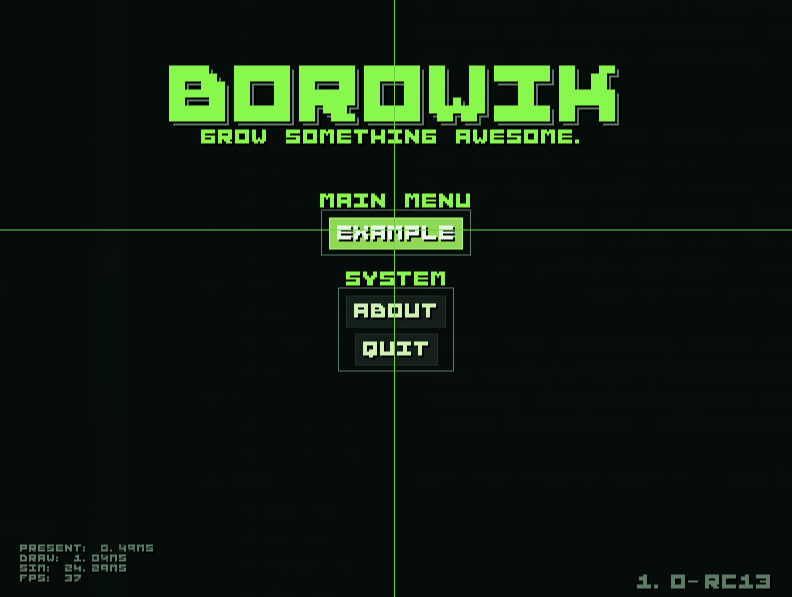
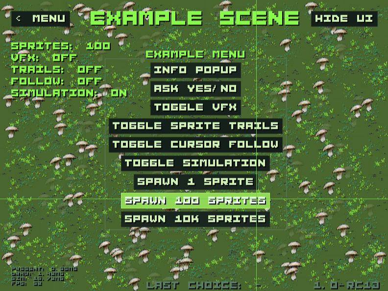
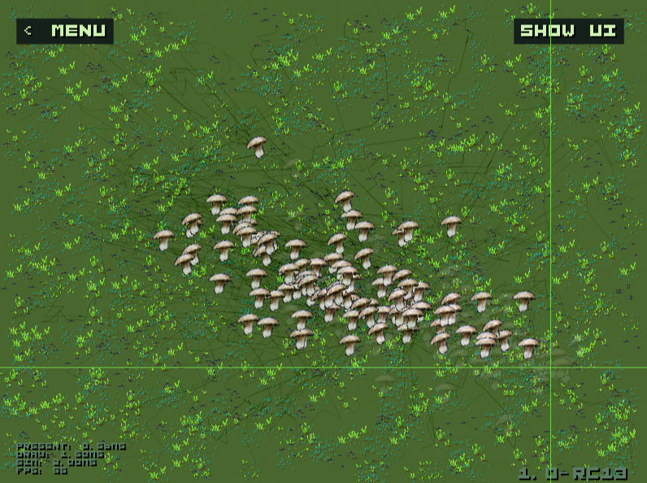

# Borowik Engine



Simple Zig engine project using the [fenster](https://github.com/zserge/fenster) software renderer.

The name comes from **borowik** ([boletus mushroom](https://en.wikipedia.org/wiki/Boletus)).

See full usage and architecture docs in [MANUAL.md](MANUAL.md).

## Example Scene

To test all the engine fetures and benchmark performance.



Sprites making trails on terrain and follow cursor.



## Engine Features

- software rendering with `fenster` backend
- generic state machine (`go_to`, `update`, `is`)
- reusable menu system (`src/engine/menu.zig`)
- immediate-mode UI helpers (`Fui`):
  - text rendering and text block drawing
  - buttons with hover and click-edge behavior
  - info popup and yes/no popup
  - pivot helpers for anchoring UI
- renderer primitives:
  - pixel, line, rect, rect outline, transparent rect
  - horizontal line, circle, flood fill
  - multi-buffer rendering (`frame` + `terrain`) with single `present()` copy per frame
  - frame timing (`dt`) and FPS cap
- sprite system (`src/engine/sprites.zig`):
  - 8-bit indexed BMP sprite-sheet loading
  - shared sheet + per-instance sprite animation state
  - configurable animation ranges and frame timing
- mouse input edge detection (`just_pressed`, `just_right_pressed`)
- theme-driven look (`src/themes/mil.zig`):
  - color palette
  - menu spacing/sizing constants
  - UI font scales
- example scene with:
  - sprite spawning (single + batch)
  - persistent terrain wear trail effect
  - toggleable VFX calculations/drawing
  - interactive popup/menu actions

## Run

```
zig build run
```

## Build

Default build:

```
zig build
```

Release builds are `ReleaseFast` and UPX-compressed.

### Linux (host target)

```
zig build release-linux
```

### Windows (32 + 64)

```
zig build release-windows
```

## Credits

Thanks to those projects:

* https://github.com/zserge/fenster
* https://jared.geek.nz/2014/01/custom-fonts-for-microcontrollers/
